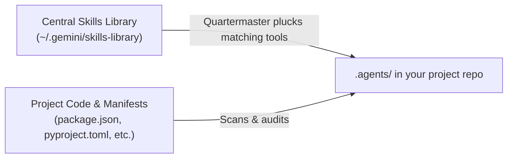

<div align="center">

# Quartermaster 🛡️

**Smart, project-scoped capability management for AI coding agents**

Stop bloating agent prompts with hundreds of global skills. Quartermaster keeps your tools in a central armory and plucks only what your current project needs directly into `.agents/`.

<br />

[](https://www.python.org/)
[](#)
[](#)
[](#)

</div>

---

## Why Quartermaster?

When you build with AI coding agents, the default approach is to dump all your skills and plugins into one global folder. That works for the first two days. Then reality catches up:

- **Prompt bloat**: Loading dozens of skills injects thousands of tokens into every conversation turn, slowing down execution and driving up costs.
- **Tool hallucination**: Agents get confused and reach for tools that make no sense for the current repo, like calling Flutter commands in a Python backend.
- **Lost in local configs**: Global setups live on one machine. When a teammate clones your repo, they have none of your agent workflows.

Quartermaster flips this model. You install all your skills and plugins into one central library. When you open a project, Quartermaster inspects the codebase and plucks only the relevant capabilities into your project's `.agents/` folder.

Everything is isolated, clean, and checked straight into Git alongside your code.

<br />



---

## Core Features

### Central Library with Project-Scoped Plucking
Collect every skill, plugin, and tool you find in your central library (`~/.gemini/skills-library`). Quartermaster inspects your project dependencies and plucks only the tools you actually need into `.agents/`. Your agent gets the exact capabilities it needs, and nothing more.

### In-Flow Git Import
Found an interesting skill or plugin on GitHub? You don't need to leave your workflow or open a terminal window to install it. Paste the Git URL straight into Quartermaster:

```bash
python3 scripts/quartermaster.py --import https://github.com/example/my-awesome-skill
```

Quartermaster clones the repository straight into your central library so it is immediately ready for any project.

### Full Plugins and Standalone Skills
Different tools come in different shapes. Quartermaster supports both:
- **Standalone Skills**: Single-focus capabilities copied into `.agents/skills/<name>/`.
- **Full Plugins**: Complete bundles containing skills, rules, lifecycle hooks, and MCP configurations copied into `.agents/plugins/<name>/`.

### Brand-New Projects & "I'm Not Sure Yet"
Starting an empty repo from scratch? Quartermaster asks what kind of software you want to build. If you haven't decided on a stack, choose **"I'm not sure yet"**.

Instead of guessing frameworks prematurely, Quartermaster equips universal Core AI-SDLC guardrails (specifications, adversarial code review, and preflight sanity checks). You get solid engineering fundamentals from day one, and Quartermaster will recommend stack-specific tools once code and manifests appear.

### Intelligent Sweeps & Pruning Governance
Codebases change. You adopt new libraries, add database layers, or deprecate old services. Running a sweep audits your current `.agents/` folder against your code:

- **Surfaces new capabilities**: Recommends newly relevant tools from your library when new dependencies are added.
- **Flags unneeded tools**: Identifies installed tools whose dependencies were removed from your code.
- **Configurable Pruning**:
  - `suggest-pruning` (default: `true`): Highlights unneeded skills and plugins so you can decide whether to drop them.
  - `auto-prune` (default: `false`): Automatically cleans up unneeded skills and plugins during sweeps, keeping your repo tidy with zero friction.

---

## Quick Start & CLI

Quartermaster runs on pure Python 3 with zero external dependencies.

### 1. Import a Tool into Your Central Library
```bash
python3 scripts/quartermaster.py --import https://github.com/example/cool-agent-skill
```

### 2. Scan a Workspace
```bash
# Scan the current directory
python3 scripts/quartermaster.py --scan

# Scan a specific project path
python3 scripts/quartermaster.py --scan /path/to/project
```

### 3. Provision Capabilities into `.agents/`
```bash
# Provision individual skills
python3 scripts/quartermaster.py --provision /path/to/project --skills spec,pr-review

# Provision full plugins
python3 scripts/quartermaster.py --provision /path/to/project --plugins spark-skills
```

### 4. Run a Sweep Audit
```bash
# Run standard sweep (recommends additions and suggests pruning)
python3 scripts/quartermaster.py --sweep /path/to/project

# Run sweep with auto-pruning enabled (removes unneeded tools automatically)
python3 scripts/quartermaster.py --sweep /path/to/project --auto-prune

# Run sweep without pruning recommendations (additions only)
python3 scripts/quartermaster.py --sweep /path/to/project --no-prune
```

### 5. Browse the Central Library Catalog
```bash
python3 scripts/quartermaster.py --catalog
```

---

## Using in Antigravity

When working inside the Antigravity agent chat, you can drive Quartermaster directly:

- **`/quartermaster`**: Launches the guided project onboarding flow.
- **`/quartermaster sweep`**: Audits the current repository and tidies capabilities.
- **`/quartermaster import <git-url>`**: Clones a skill or plugin repository into your central library without breaking flow.
- **Daily Sweep**: Schedule a recurring daily background sweep (`0 9 * * *` via `/schedule`) to keep your workspace outfitted as your codebase grows.

---

## Settings & Configuration

Settings are stored globally in `~/.gemini/quartermaster/config.json`.

```bash
# View all active settings
python3 scripts/quartermaster.py --config

# Check your central skills library path
python3 scripts/quartermaster.py --config-get skills-library

# Set a custom library location
python3 scripts/quartermaster.py --config-set skills-library /path/to/my-library

# Enable auto-pruning during sweeps
python3 scripts/quartermaster.py --config-set auto-prune true

# Suppress pruning suggestions by default
python3 scripts/quartermaster.py --config-set suggest-pruning false
```

---

<div align="center">
Built for modern agentic workflows with Antigravity.
</div>
