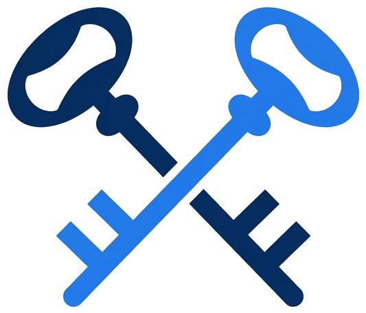
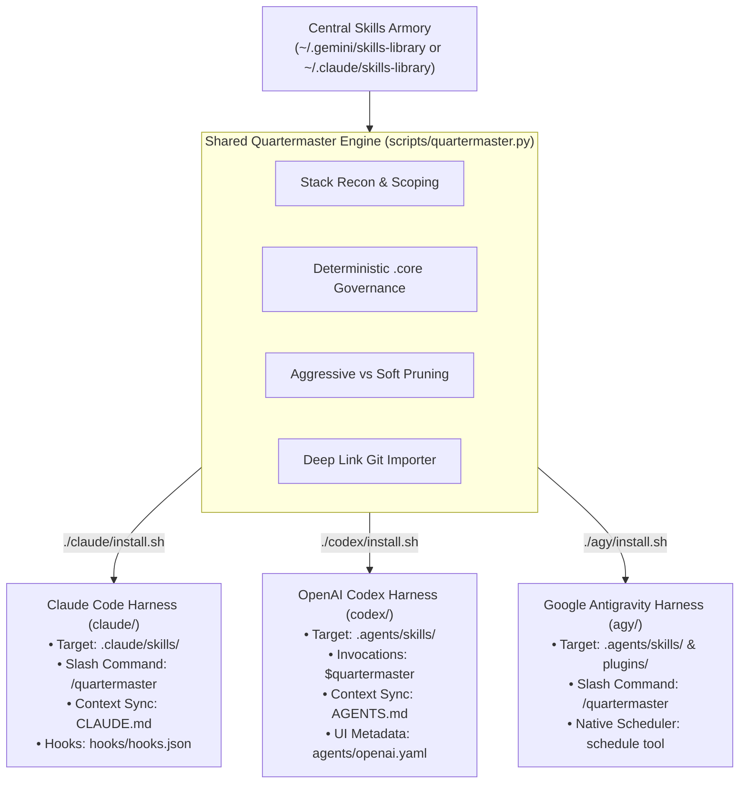

<div align="center">

<picture>
  <source media="(prefers-color-scheme: dark)" srcset="assets/icon_dark.png">
  <source media="(prefers-color-scheme: light)" srcset="assets/icon.png">
  
</picture>

# Quartermaster

**Smart, project-scoped capability provisioner & skills armory for AI coding agents**

Stop bloating agent context windows with hundreds of global skills. Quartermaster maintains your tools in a central armory and plucks only the capabilities your active project needs directly into your repository.

<br />

[](#)
[](#)
[](#)
[](#)

</div>

---

## Single-Command Installation from Root

Install Quartermaster with a single command tailored to your agent harness:

| Agent Harness | Single Installation Command | What It Does |
| :--- | :--- | :--- |
| **Anthropic Claude Code** | `./claude/install.sh` | Links to `~/.claude/skills/quartermaster`, enabling `/quartermaster` everywhere across your machine |
| **OpenAI Codex CLI** | `./codex/install.sh` | Links to `~/.agents/skills/quartermaster`, natively discovered by Codex CLI for `$quartermaster` |
| **Google Antigravity (AGY)** | `./agy/install.sh` | Links to `~/.gemini/config/skills/quartermaster`, enabling `/quartermaster` in all AGY workspaces |

---

## Multi-Harness Architecture

Quartermaster uses a single, shared Python 3 engine (`scripts/quartermaster.py`) with zero external pip dependencies. Dedicated harness adapters interface natively with each agent environment:



---

## How It Works in Each Harness

### 1. Anthropic Claude Code (`claude/`)
- **Invocation**: Type `/quartermaster` or `/quartermaster sweep` directly into chat.
- **Skill Format**: Follows modern Claude progressive disclosure (`SKILL.md` with `user-invocable: true` and XML structural tags).
- **Target Location**: Scoped skills are provisioned into `<project>/.claude/skills/<name>/`.
- **Project Memory (`CLAUDE.md`)**: Automatically writes and maintains an active capabilities table in `<project>/CLAUDE.md`.
- **SessionStart Hook**: Fast timestamp check (`claude/hooks/session_sweep.py`) alerts developers when codebase dependencies change without background daemon overhead.
- **Local Plugin Run**: `claude --plugin-dir /path/to/quartermaster/claude`

### 2. OpenAI Codex CLI (`codex/`)
- **Invocation**: Mention `$quartermaster` or `$quartermaster sweep` in your prompt, or ask naturally to audit project skills.
- **Native Discovery**: The Rust runtime of OpenAI Codex CLI natively scans `.agents/skills/` and `~/.agents/skills/` out of the box.
- **Target Location**: Scoped skills are provisioned into `<project>/.agents/skills/<name>/`.
- **Project Instructions (`AGENTS.md`)**: Automatically writes and updates an active capability block in `<project>/AGENTS.md`.
- **UI & Invocations**: Includes `agents/openai.yaml` for brand color, icon, and display configuration in Codex interfaces.

### 3. Google Antigravity (`agy/`)
- **Invocation**: Type `/quartermaster` or `/quartermaster sweep` in chat.
- **Target Location**: Provisions standalone skills into `.agents/skills/` and full plugins into `.agents/plugins/`.
- **Automated Sweeps**: Registers background daily sweeps using Antigravity's native `schedule` runtime tool (`CronExpression="0 9 * * *"`).

---

## Core Commands

| Command / Mention | Action |
| :--- | :--- |
| **`/quartermaster`** or **`$quartermaster`** | Scans project manifests, guides scoping, and provisions capabilities into your repo |
| **`/quartermaster sweep`** or **`$quartermaster sweep`** | Audits installed tools against codebase manifests, auto-equips new matches, and flags unneeded tools |
| **`/quartermaster import <git-url>`** | Clones a git repo or extracts a deep skill link into the central armory and active project |
| **`/quartermaster core [add\|remove\|list]`** | Manages deterministic `.core` marker files protecting permanent guardrails from pruning |
| **`/quartermaster catalog`** | Browses all available capabilities in your central library armory |
| **`/quartermaster config`** | Views or updates library path, auto-add, and pruning settings |
| **`/quartermaster schedule`** | Sets up or verifies the automated daily sweep for your workspace |

---

## Key Features

### Central Library with Scoped Plucking
Store all your skills and plugins in one central armory (`~/.gemini/skills-library` or `~/.claude/skills-library`). Quartermaster inspects project manifests and plucks only what your active project needs.

### Deterministic Core Governance (.core Markers)
Rather than hardcoding proprietary package lists, Quartermaster uses a transparent, filesystem-based `.core` marker file in each capability directory. Tools marked with `.core` files are permanent guardrails and are strictly immune to pruning during sweeps.

Conventional workflow tools (`spec`, `pr-review`, `pm`, `preflight`, `wayfinder`) are automatically bootstrapped with `.core` markers. You can designate any capability as Core via `/quartermaster core add <name>`.

### In-Flow Git Import & Deep Link Extraction
Paste a Git URL directly into chat without breaking flow:
```text
/quartermaster import https://github.com/example/cool-skill
/quartermaster import https://github.com/owner/repo/blob/main/skills/dependency-upgrade/SKILL.md
```
Quartermaster handles both full repositories and deep links pointing to individual skills inside monorepos, extracting the targeted skill directly into your central library and active project.

### Brand-New Projects & "I'm Not Sure Yet"
Starting an empty project? Choose **"I'm not sure yet"** during scoping. Quartermaster equips universal Core capabilities (`spec`, `pr-review`, `pm`, `preflight`, `wayfinder`) without guessing frameworks prematurely. Stack-specific tools remain deferred until code manifests emerge.

### Intelligent Sweeps & Pruning Governance
Codebases evolve. Running a sweep audits your repository capabilities against active manifests:
- **Auto-Equip New Capabilities**: When you add new frameworks (`package.json`, `pyproject.toml`, `pubspec.yaml`), Quartermaster immediately provisions matching tools from your central armory.
- **Aggressive Pruning (Default)**: Strict stack alignment. If an installed tool lacks a `.core` marker and no longer matches active manifests, it is flagged for removal. Because re-equipping takes milliseconds, keeping repos lean prevents token waste.
- **Soft Pruning (Optional)**: Conservative retention. Preserves auxiliary or cross-cutting tools unless an explicit contradiction occurs.
- **Settings**:
  - `auto-add` (default: `true`): Automatically installs matching tools.
  - `pruning-mode` (default: `aggressive`): Toggles between `aggressive` and `soft`.
  - `suggest-pruning` (default: `true`): Reports removal recommendations.
  - `auto-prune` (default: `false`): Automatically deletes unneeded non-core tools during sweeps.

---

## Repository Structure

```text
quartermaster/
├── README.md                      # Multi-harness documentation & quickstart
├── scripts/
│   └── quartermaster.py           # Shared universal Python 3 engine (zero pip dependencies)
├── assets/                        # Shared logos and icons
│
├── agy/                           # Google Antigravity harness
│   ├── SKILL.md                   # Native AGY skill definition
│   ├── install.sh                 # Global installer for Antigravity
│   └── README.md                  # AGY quickstart
│
├── claude/                        # Anthropic Claude Code harness
│   ├── .claude-plugin/
│   │   └── plugin.json            # Claude Code plugin manifest
│   ├── skills/
│   │   └── quartermaster/
│   │       ├── SKILL.md           # Progressive disclosure skill (user-invocable: true)
│   │       └── references/        # Detailed on-demand runbooks
│   ├── hooks/
│   │   ├── hooks.json             # Lifecycle hook configuration (SessionStart)
│   │   └── session_sweep.py       # Fast (<20ms) daily sweep check
│   ├── install.sh                 # Global installer for Claude Code
│   └── README.md                  # Claude Code quickstart
│
└── codex/                         # OpenAI Codex CLI harness
    ├── SKILL.md                   # Codex-native skill entrypoint
    ├── agents/
    │   └── openai.yaml            # Codex UI & invocation policy metadata
    ├── AGENTS.md                  # Project instructions template
    ├── config.toml.example        # Example .codex/config.toml
    ├── install.sh                 # Global installer for Codex CLI
    └── README.md                  # Codex quickstart
```

---

<div align="center">
Built for modern agentic workflows across Claude Code, OpenAI Codex, and Google Antigravity.
</div>
