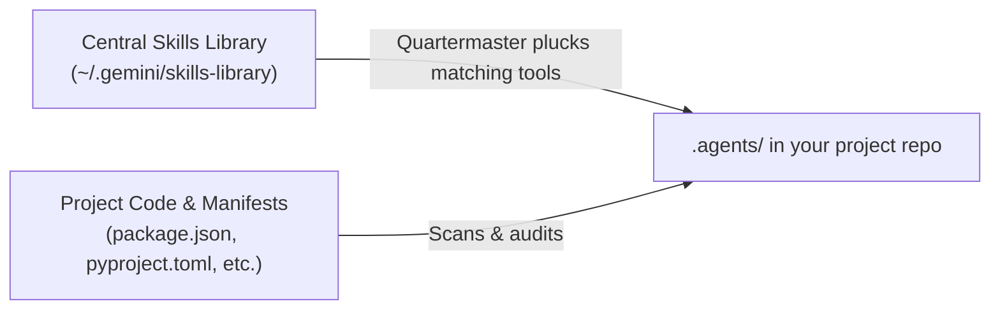

<div align="center">

<picture>
  <source media="(prefers-color-scheme: dark)" srcset="assets/icon_dark.png">
  <source media="(prefers-color-scheme: light)" srcset="assets/icon.png">
  
</picture>

# Quartermaster

**Smart, project-scoped skill & plugin management for AI coding agents**

Stop bloating agent prompts with hundreds of global skills. Quartermaster keeps your tools in a central armory and plucks only what your current project needs directly into `.agents/`.

<br />

[](#)
[](#)
[](#)
[](#)

</div>

---

## Installation

Install Quartermaster as an Antigravity skill with a single command:

```bash
git clone https://github.com/owainow/quartermaster.git ~/.gemini/config/skills/quartermaster
```

That is it. Antigravity discovers the skill automatically. Open any workspace and type `/quartermaster` in chat to get started.

---

## Why Quartermaster?

When you build with AI coding agents, the default approach is to dump all your skills and plugins into one global folder. That works for the first two days. Then reality catches up:

- **Prompt bloat**: Loading dozens of skills injects thousands of tokens into every conversation turn, slowing down execution and driving up costs.
- **Tool hallucination**: Agents get confused and reach for tools that make no sense for the current repo, like calling Flutter commands in a Python backend.
- **Lost in local configs**: Global setups live on one machine. When a teammate clones your repo, they have none of your agent workflows.

Quartermaster flips this model. You install all your skills and plugins into one central library. When you open a project, Quartermaster inspects the codebase and plucks only the relevant capabilities into your project's `.agents/` folder.

Everything is isolated, clean, and checked straight into Git alongside your code.

<br />



---

## Slash Commands

Quartermaster is an Antigravity skill designed to be driven directly from your agent chat. You never have to switch to a terminal or run manual scripts.

| Slash Command | What It Does |
| :--- | :--- |
| **`/quartermaster`** | Scans current repo, scopes what you need, and outfits `.agents/` |
| **`/quartermaster sweep`** | Audits installed tools, recommends new additions, and suggests pruning |
| **`/quartermaster import <git-url>`** | Clones a skill or plugin directly into your central library without breaking flow |
| **`/quartermaster catalog`** | Browses all available capabilities in your central armory |
| **`/quartermaster config`** | Checks or updates your library path and pruning settings |
| **`/quartermaster schedule`** | Sets up or verifies the automated daily sweep for your workspace |

---

### 1. Onboard a Project: `/quartermaster`

Type `/quartermaster` in your chat. Quartermaster inspects your project manifests (`package.json`, `pubspec.yaml`, `pyproject.toml`, `Dockerfile`, etc.), presents matching capabilities from your central library, and outfits `.agents/` with only what your stack needs.

Starting an empty project? Choose **"I'm not sure yet"** during scoping. Quartermaster equips universal Core AI-SDLC guardrails (specifications, adversarial review, and preflight sanity checks) without guessing frameworks prematurely.

---

### 2. Audit and Tidy Up: `/quartermaster sweep`

Codebases change as you build. Run `/quartermaster sweep` at any time to:
- **Auto-Equip New Capabilities**: Because your central skills library is an already-curated collection of tools, Quartermaster **automatically provisions** matching skills and plugins straight into `.agents/` as soon as new dependencies appear in your project.
- **Highlight Unneeded Tools**: Identifies installed tools whose manifests were removed so your agent prompts stay lean.

Flags supported:
- `/quartermaster sweep --auto-prune`: Runs the sweep and automatically uninstalls unneeded tools from `.agents/`.
- `/quartermaster sweep --no-prune`: Reviews additions only and suppresses removal suggestions.
- `/quartermaster sweep --no-auto-add`: Lists recommendations without automatically installing them (dry run).

---

### 3. Add Skills Without Breaking Flow: `/quartermaster import <git-url>`

Found an interesting agent skill or plugin on GitHub? Just paste it into chat:

```text
/quartermaster import https://github.com/example/awesome-coding-skill
```

Quartermaster clones the repository straight into your central library (`~/.gemini/skills-library`), discovers all skills and plugins inside, and makes it available to provision into any project immediately.

---

### 4. Explore Available Capabilities: `/quartermaster catalog`

Want to see what tools are in your armory? Run `/quartermaster catalog` in chat to view a breakdown of every skill and plugin in your library, grouped by package and classified as either Core AI-SDLC or Stack-specific.

---

### 5. Check or Change Settings: `/quartermaster config`

Type `/quartermaster config` in chat to inspect your active settings or update:
- `skills-library`: The folder where all your skills and plugins are stored (default: `~/.gemini/skills-library`).
- `auto-add`: Whether sweeps automatically install matching tools into `.agents/` (default: `true`).
- `suggest-pruning`: Whether sweeps recommend removing unneeded tools (default: `true`).
- `auto-prune`: Whether sweeps automatically delete unneeded tools without asking (default: `false`).

---

## Core Features

### Central Library with Project-Scoped Plucking
Collect every skill, plugin, and tool in your central library (`~/.gemini/skills-library`). Quartermaster inspects your project dependencies and plucks only the tools you actually need into `.agents/`. Your agent gets the exact capabilities it needs, and nothing more.

### In-Flow Git Import
You never have to stop coding or open a terminal window to install new agent capabilities. Paste a Git repository URL directly into your chat, and Quartermaster brings it into your armory on the fly.

### Full Plugins and Standalone Skills
Different tools come in different shapes. Quartermaster handles both automatically:
- **Standalone Skills**: Single-focus capabilities copied into `.agents/skills/<name>/`.
- **Full Plugins**: Complete bundles containing skills, rules, lifecycle hooks, and MCP configurations copied into `.agents/plugins/<name>/`.

### Brand-New Projects & "I'm Not Sure Yet"
Starting an empty repo from scratch? Quartermaster asks what kind of software you want to build. If you haven't decided on a stack, choose **"I'm not sure yet"**.

Instead of guessing frameworks prematurely, Quartermaster equips universal Core AI-SDLC guardrails (specifications, adversarial code review, and preflight sanity checks). You get solid engineering fundamentals from day one, and Quartermaster will recommend stack-specific tools once code and manifests appear.

### Intelligent Sweeps & Auto-Equipping
Running a sweep audits your current `.agents/` folder against your code:
- **Automatically equips matching tools**: As soon as you add new manifests (`package.json`, `pyproject.toml`, etc.), Quartermaster detects matching tools in your central library and installs them directly into `.agents/`.
- **Flags unneeded tools**: Identifies installed tools whose dependencies were removed from your code.
- **Configurable Settings**:
  - `auto-add` (default: `true`): Automatically provisions newly matched tools straight into `.agents/`.
  - `suggest-pruning` (default: `true`): Recommends removing unneeded tools so you can make the call.
  - `auto-prune` (default: `false`): Automatically cleans up unneeded tools during sweeps, keeping your repo tidy with zero friction.

---

## Automated Daily Sweeps

Quartermaster keeps your workspace continuously optimized by running in the background once a day.

- **Set up automatically**: When you onboard a project with `/quartermaster`, the daily sweep is scheduled for you automatically.
- **On-demand activation**: You can also register or verify the schedule at any time by typing `/quartermaster schedule` in chat.
- **Quiet by default**: Sweeps run at 9:00 AM every day. If no changes are detected, it finishes silently. If new matching tools or cleanup candidates are found, it alerts you with a quick summary.

---

<div align="center">
Built for modern agentic workflows with Antigravity.
</div>
