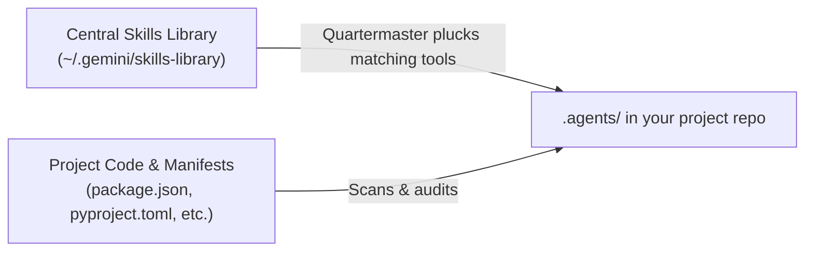

<div align="center">

# Quartermaster 🛡️

**Smart, project-scoped capability management for AI coding agents**

Stop bloating agent prompts with hundreds of global skills. Quartermaster keeps your tools in a central armory and plucks only what your current project needs directly into `.agents/`.

<br />

[](https://www.python.org/)
[](#)
[](#)
[](#)

</div>

---

## Why Quartermaster?

When you build with AI coding agents, the default approach is to dump all your skills and plugins into one global folder. That works for the first two days. Then reality catches up:

- **Prompt bloat**: Loading dozens of skills injects thousands of tokens into every conversation turn, slowing down execution and driving up costs.
- **Tool hallucination**: Agents get confused and reach for tools that make no sense for the current repo, like calling Flutter commands in a Python backend.
- **Lost in local configs**: Global setups live on one machine. When a teammate clones your repo, they have none of your agent workflows.

Quartermaster flips this model. You install all your skills and plugins into one central library. When you open a project, Quartermaster inspects the codebase and plucks only the relevant capabilities into your project's `.agents/` folder.

Everything is isolated, clean, and checked straight into Git alongside your code.

<br />



---

## Slash Commands (Chat-First Experience)

Because Quartermaster is an Antigravity skill, you drive it directly from your agent chat with slash commands. No need to switch to a terminal or remember Python script arguments.

| Slash Command | What It Does |
| :--- | :--- |
| **`/quartermaster`** | Scans current repo, scopes what you need, and outfits `.agents/` |
| **`/quartermaster sweep`** | Audits installed tools, recommends new additions, and suggests pruning |
| **`/quartermaster import <git-url>`** | Clones a skill or plugin directly into your central library without breaking flow |
| **`/quartermaster catalog`** | Browses all available capabilities in your central armory |
| **`/quartermaster config`** | Checks or updates your library path and pruning settings |

### 1. Onboard a Project: `/quartermaster`
Type `/quartermaster` in your chat. Quartermaster immediately inspects your repo manifests (`package.json`, `pubspec.yaml`, `pyproject.toml`, `Dockerfile`, etc.), presents matching capabilities, and outfits `.agents/` with only what your stack requires.

Starting from an empty folder? Choose **"I'm not sure yet"** during scoping to equip universal Core AI-SDLC guardrails (specifications, adversarial review, sanity checks) without premature framework clutter.

### 2. Audit and Tidy Up: `/quartermaster sweep`
Codebases change. Run `/quartermaster sweep` at any time to:
- Detect newly added dependencies in your project and recommend matching tools from your armory.
- Highlight unneeded tools whose manifests were removed so your prompts stay lean.
- Use `/quartermaster sweep --auto-prune` to automatically delete unneeded tools.
- Use `/quartermaster sweep --no-prune` to review additions only.

### 3. Add Skills Without Breaking Flow: `/quartermaster import <git-url>`
Found an interesting agent skill or plugin on GitHub? Just paste it into chat:

```text
/quartermaster import https://github.com/example/awesome-coding-skill
```

Quartermaster clones the repository straight into your central library (`~/.gemini/skills-library`), discovers all skills and plugins inside, and makes it available to provision into any project immediately.

### 4. Explore Available Capabilities: `/quartermaster catalog`
Want to see what tools are in your armory? Run `/quartermaster catalog` to view a breakdown of every skill and plugin in your library, categorized by package and classified as either Core AI-SDLC or Stack-specific.

### 5. Check or Change Settings: `/quartermaster config`
Inspect your active settings or change your central library path and pruning preferences directly from chat.

---

## Core Features

### Central Library with Project-Scoped Plucking
Collect every skill, plugin, and tool in your central library (`~/.gemini/skills-library`). Quartermaster inspects your project dependencies and plucks only the tools you actually need into `.agents/`. Your agent gets the exact capabilities it needs, and nothing more.

### In-Flow Git Import
You never have to stop coding or open a terminal window to install new agent capabilities. Paste a Git repository URL directly into your chat, and Quartermaster brings it into your armory on the fly.

### Full Plugins and Standalone Skills
Different tools come in different shapes. Quartermaster handles both automatically:
- **Standalone Skills**: Single-focus capabilities copied into `.agents/skills/<name>/`.
- **Full Plugins**: Complete bundles containing skills, rules, lifecycle hooks, and MCP configurations copied into `.agents/plugins/<name>/`.

### Brand-New Projects & "I'm Not Sure Yet"
Starting an empty repo from scratch? Quartermaster asks what kind of software you want to build. If you haven't decided on a stack, choose **"I'm not sure yet"**.

Instead of guessing frameworks prematurely, Quartermaster equips universal Core AI-SDLC guardrails (specifications, adversarial code review, and preflight sanity checks). You get solid engineering fundamentals from day one, and Quartermaster will recommend stack-specific tools once code and manifests appear.

### Intelligent Sweeps & Pruning Governance
Running a sweep audits your current `.agents/` folder against your code:
- **Surfaces new capabilities**: Recommends newly relevant tools from your library when new dependencies are added.
- **Flags unneeded tools**: Identifies installed tools whose dependencies were removed from your code.
- **Configurable Pruning Settings**:
  - `suggest-pruning` (default: `true`): Recommends removing unneeded tools so you can make the call.
  - `auto-prune` (default: `false`): Automatically cleans up unneeded tools during sweeps, keeping your repo tidy with zero friction.

---

## Automated Daily Sweeps

You can keep your project workspace continuously optimized by running a background sweep once a day.

Use the Antigravity `/schedule` command in chat to register a recurring daily cron job:
- **Schedule**: `0 9 * * *` (daily at 9:00 AM)
- **Prompt**: `"Run Quartermaster background sweep using python3 ~/quartermaster/scripts/quartermaster.py --sweep . --json and notify if additions or pruning recommendations are detected."`

If no changes are detected, it finishes silently. If newly added packages or unneeded tools are found, it alerts you with a quick summary.

---

## Settings & Configuration

Settings are saved globally in `~/.gemini/quartermaster/config.json`. You can manage them via chat with `/quartermaster config` or via the CLI:

```bash
# View active settings
python3 scripts/quartermaster.py --config

# Check your central skills library path
python3 scripts/quartermaster.py --config-get skills-library

# Set a custom library location
python3 scripts/quartermaster.py --config-set skills-library /path/to/my-library

# Enable auto-pruning during sweeps
python3 scripts/quartermaster.py --config-set auto-prune true

# Suppress pruning suggestions by default
python3 scripts/quartermaster.py --config-set suggest-pruning false
```

---

## Headless CLI & Automation Engine

While Quartermaster is built to be driven through slash commands inside chat, the underlying Python script runs on any machine with pure Python 3 and zero external dependencies. This makes it ideal for CI/CD pipelines, Docker setup scripts, or terminal workflows:

```bash
# Scan a project
python3 scripts/quartermaster.py --scan /path/to/project

# Provision skills or plugins directly
python3 scripts/quartermaster.py --provision /path/to/project --skills spec,pr-review
python3 scripts/quartermaster.py --provision /path/to/project --plugins spark-skills

# Run automated sweep with JSON output
python3 scripts/quartermaster.py --sweep /path/to/project --json

# Import a repository into the central armory
python3 scripts/quartermaster.py --import https://github.com/example/cool-skill
```

---

<div align="center">
Built for modern agentic workflows with Antigravity.
</div>
