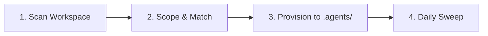

<div align="center">

# Quartermaster 🛡️

**A skill for smarter skill installation and management**

Stop bloating system prompts with hundreds of global skills. Quartermaster inspects your workspace and provisions only the tools and plugins your project actually needs.

<br />

[](https://www.python.org/)
[](#)
[](#)
[](#)

</div>

---

## The Problem & The Solution

<br />

| The Global Skill Trap ❌ | The Quartermaster Way ✅ |
| :--- | :--- |
| **Bloated System Prompts**: Loading dozens of global skills dumps thousands of irrelevant tokens into every turn. | **Project-Scoped Isolation**: Tools live in `<project>/.agents/`. Only the tools needed for your project are loaded. |
| **Tool Hallucination**: Agents get confused and reach for tools they should not use (e.g. Android CLI on a Python API). | **Accurate Reconnaissance**: Automatically inspects manifests (`package.json`, `pubspec.yaml`, `pyproject.toml`) to match your stack. |
| **Machine-Bound**: Global configs stay on one machine and never make it into version control. | **Team-Ready**: Checked into git inside `.agents/` so your whole team gets the exact same agent capabilities. |
| **Stale Setup**: Projects evolve, but agents keep using day-one tools. | **Day-Two Sweeps**: Regular audits check for newly added dependencies and suggest matching skills quietly in the background. |

<br />

---

## Table of Contents

- [Core Features](#core-features)
- [How It Works](#how-it-works)
- [The 7 Armory Domains](#the-7-armory-domains)
- [Quick Start & CLI](#quick-start--cli)
- [Using in Antigravity](#using-in-antigravity)
- [Settings & Configuration](#settings--configuration)

---

## Core Features

### 📦 Full Plugin and Skill Support
Antigravity supports both standalone skills and comprehensive plugins. Quartermaster handles both automatically:
- **Standalone Skills** go into `.agents/skills/<name>/` with their own `SKILL.md` and scripts.
- **Full Plugins** go into `.agents/plugins/<name>/`, bundling skills, rules (`AGENTS.md`), lifecycle hooks (`hooks.json`), and MCP server configs together.

### 🧭 Brand-New Projects & "I'm Not Sure Yet"
Starting from an empty directory? Quartermaster doesn't guess. It asks what you're planning to build.
- If your stack is undecided, choose **"I'm not sure yet"**.
- Quartermaster equips only universal **General AI-SDLC** skills (spec-driven design, adversarial review, preflight checks). You get rock-solid engineering guardrails from day one without premature framework clutter.

### 🧹 Project Sweep (`--sweep`)
As your project grows, your agent's toolkit should grow with it:
- **On-Demand Audit**: Audits your active `.agents/` folder, detects new dependencies in your code, and recommends newly relevant skills from your armory.
- **Scheduled Background Sweeps**: Run once a day with `--additions-only`. It works quietly in the background, only suggesting new tools without nagging you to remove existing ones.

### 🔗 Library Independence
Quartermaster doesn't bundle static skills. It references your central skills library (defaulting to `~/.gemini/skills-library`). Point it to your team's repo or personal collection with a single command.

---

## How It Works



1. **Scan**: Inspects project files (`pubspec.yaml`, `package.json`, `pyproject.toml`, `firebase.json`, `Dockerfile`, etc.).
2. **Scope**: Separates universal engineering guardrails from domain-specific tools. For new projects, triggers a quick scoping dialogue.
3. **Provision**: Copies self-contained skill or plugin directories directly into `<project>/.agents/`.
4. **Sweep**: Periodically checks for new project requirements and surfaces matching capabilities from your central library.

---

## The 7 Armory Domains

Quartermaster categorizes capabilities from your library into 7 functional domains:

| Domain | Key Packages | What It Provides |
| :--- | :--- | :--- |
| **Mobile & Multiplatform** | `flutter`, `android-cli-plugin` | Architecture best practices, responsive layouts, unit testing, and Android emulator tooling. |
| **Web, Frontend & Design** | `chrome-devtools-plugin`, `impeccable`, `modern-web-guidance` | High-craft UI design polish, DevTools MCP debugging, and modern web architecture. |
| **Cloud & Backend** | `firebase`, `cloudrun` | Cloud Firestore, Auth, Hosting, Security Rules auditing, and serverless deployment. |
| **Testing, SDD & ADLC** | `spark-skills`, `agora-adlc`, `conductor` | Spec-driven development (`spec`), adversarial PR review (`pr-review`), and preflight verification. |
| **Synthetic Data & Simulation** | `synthetikos` | Realistic persona simulation (`customer`, `colleague`), business ledgers, and evaluation datasets. |
| **Science & Bio-Informatics** | `science` | PubMed/arXiv search, AlphaFold/PDB structure analysis, genomics, and `uv` package management. |
| **AI Agent Development** | `google-antigravity-sdk` | Multi-agent orchestration, tool creation, and agent evaluation workflows. |

---

## Quick Start & CLI

Quartermaster runs on pure Python 3 with zero external dependencies.

### 1. Scan a Project
```bash
# Scan current directory
python3 scripts/quartermaster.py --scan

# Scan a specific project path
python3 scripts/quartermaster.py --scan /path/to/project
```

### 2. Provision Skills or Full Plugins
```bash
# Provision individual skills into .agents/skills/
python3 scripts/quartermaster.py --provision /path/to/project --skills impeccable,spec,pr-review

# Provision full plugins into .agents/plugins/
python3 scripts/quartermaster.py --provision /path/to/project --plugins spark-skills,firebase
```

### 3. Run a Sweep Audit
```bash
# On-demand sweep (shows additions and potential cleanup)
python3 scripts/quartermaster.py --sweep /path/to/project

# Background mode (strictly additions, zero friction)
python3 scripts/quartermaster.py --sweep /path/to/project --additions-only --json
```

### 4. Browse the Catalog
```bash
python3 scripts/quartermaster.py --catalog
```

---

## Using in Antigravity

When working inside the Antigravity chat interface, Quartermaster is available directly:

- **`/quartermaster`**: Launches the guided 5-stage project onboarding interview.
- **`/quartermaster sweep`**: Audits the current repository and suggests newly relevant tools.
- **Daily Cron**: Schedule a recurring daily background sweep (`0 9 * * *` via `/schedule`) to keep your workspace outfitted as your codebase grows.

---

## Settings & Configuration

Settings are saved globally in `~/.gemini/quartermaster/config.json`.

```bash
# View active settings
python3 scripts/quartermaster.py --config

# Check current skills library location
python3 scripts/quartermaster.py --config-get skills-library

# Point to a custom skills library
python3 scripts/quartermaster.py --config-set skills-library /path/to/my-library
```

---

<div align="center">
Built for modern agentic workflows with Antigravity.
</div>

