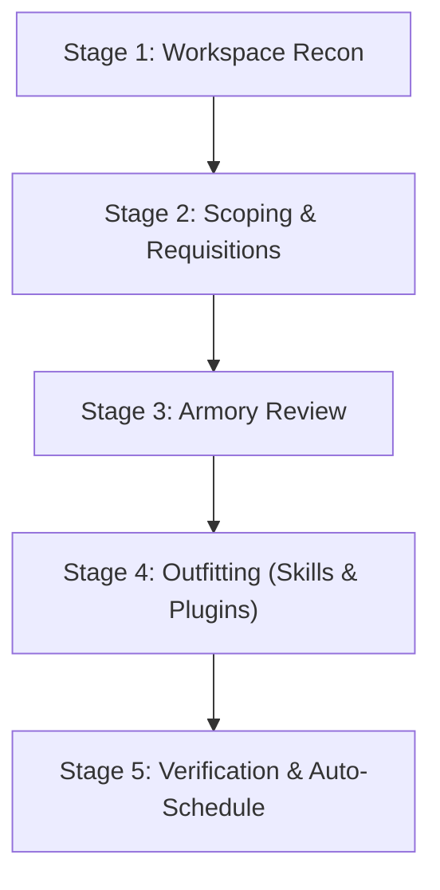

# Quartermaster: Project Onboarding & Skill Provisioning Armory

Quartermaster equips workspaces with project-scoped skills and full plugins tailored to their exact technology stack. Instead of overloading agents with global skills, Quartermaster provisions self-contained capabilities directly into `<workspace>/.agents/skills/` and `<workspace>/.agents/plugins/`, eliminating global token pollution and tool hallucination.

Quartermaster references an external central **skills library** (default: `~/.gemini/skills-library`), which can be configured via interactive settings. All skills and plugins live in the central library first, and Quartermaster dynamically plucks only the relevant capabilities into your project.

---

## Slash Commands Quick Reference

| Command | Action |
| :--- | :--- |
| **`/quartermaster`** | Run 5-stage workspace recon, scoping, capability provisioning, and auto-schedule |
| **`/quartermaster sweep`** | Audit active tools, recommend additions, and suggest or auto-prune unneeded tools |
| **`/quartermaster import <git-url>`** | Shallow-clone a skill or plugin git repository directly into your central armory |
| **`/quartermaster catalog`** | Browse all packages, plugins, and skills available in the central library |
| **`/quartermaster config`** | View or modify settings (`skills-library`, `suggest-pruning`, `auto-prune`) |
| **`/quartermaster schedule`** | Automatically register or verify the daily background sweep for this workspace |

---

## Command 1: Initial Project Onboarding (`/quartermaster`)

When the user runs `/quartermaster`, execute the 5-stage onboarding workflow:



### Stage 1: Workspace Reconnaissance

1. **Identify Workspace Path**: Determine the active project root directory (defaults to current workspace).
2. **Execute Stack Scan**:
   ```bash
   python3 ~/.gemini/config/skills/quartermaster/scripts/quartermaster.py --scan <project_path> --json
   ```
3. **Examine Findings**:
   - Check `status`: Is this an active project with manifests, or an `unscoped_new_project`?
   - Review detected manifests (`pubspec.yaml`, `package.json`, `pyproject.toml`, `firebase.json`, `Cargo.toml`, `Dockerfile`, etc.).

---

### Stage 2: Scoping & Tailored Requisitions

#### Scenario A: Brand-New / Unscoped Project
If `status == "unscoped_new_project"` (no manifests found or empty directory):
1. **Interactive Scoping Dialogue**: Engage the user in a short scoping conversation:
   - *Option 1*: Web or Frontend Application
   - *Option 2*: Mobile or Multiplatform Application
   - *Option 3*: Backend API, Cloud or Database Service
   - *Option 4*: AI Agent or Machine Learning System
   - *Option 5*: DevOps, Infrastructure or Tooling
   - *Option 6*: **"I'm not sure yet"** (Exploring, prototyping, or undecided)

2. **The "I'm not sure yet" Rule**:
   > [!IMPORTANT]
   > Whenever the user chooses **"I'm not sure yet"** or the scope is broad/unclear, Quartermaster **strictly equips universal Core AI-SDLC skills only** (`spec`, `pr-review`, `preflight`, `wayfinder`).
   > It explicitly avoids stack-specific tools (e.g. Flutter, Firebase, DevTools) until tech stack choices emerge. Explain this rationale to the user:
   > *"Since the project scope is still emerging, I will equip only foundational AI-SDLC guardrails (spec-driven engineering, adversarial review, preflight checks). As you create manifests and code, Quartermaster will suggest matching tech skills later via the daily sweep."*

#### Scenario B: Active Project with Identified Manifests
Present the detected technologies and categorize recommendations:
- **Core AI-SDLC Baseline**: Universal guardrails (`spec`, `pr-review`, `preflight`, `wayfinder`).
- **Stack-Specific Capabilities**: Matched plugins (e.g. `modern-web-guidance-plugin`, `firebase`, `flutter`) and skills (e.g. `impeccable`, `uv`).

---

### Stage 3: Armory Review

Invite the user to inspect available packages and plugins discovered in the central skills library:
```bash
python3 ~/.gemini/config/skills/quartermaster/scripts/quartermaster.py --catalog
```
Allow the user to select any additional tools they wish to include.

---

### Stage 4: Outfitting (Dual Skill & Plugin Provisioning)

Once the user confirms their selection, execute the provisioning command:
```bash
python3 ~/.gemini/config/skills/quartermaster/scripts/quartermaster.py \
  --provision <project_path> \
  --skills <comma_separated_items>
```

Quartermaster automatically routes:
- **Full Plugins** (packages containing `plugin.json`, e.g. `spark-skills`, `firebase`, `flutter`) &rarr; `<project_path>/.agents/plugins/<plugin_name>/`
- **Standalone Skills** (e.g. `impeccable`, `uv`) &rarr; `<project_path>/.agents/skills/<skill_name>/`

---

### Stage 5: Verification & Auto-Schedule

1. **Verify Installed Directory Structure**:
   - Check that `.agents/plugins/` contains full plugin bundles.
   - Check that `.agents/skills/` contains standalone skills.
2. **Present Confirmation Summary**:
   | Capability Name | Type | Destination |
   | :--- | :--- | :--- |
   | `spark-skills` | Plugin | `.agents/plugins/spark-skills/` |
   | `impeccable` | Skill | `.agents/skills/impeccable/` |
3. **Automatically Register Daily Sweep**:
   - Actively call the `schedule` tool:
     - `CronExpression`: `"0 9 * * *"`
     - `IsDaemon`: `true`
     - `Prompt`: `"Run /quartermaster sweep and notify only if additions or pruning recommendations are detected."`
   - Confirm to the user:
     *"Daily sweep scheduled: Quartermaster will run in the background daily at 9:00 AM to keep your workspace outfitted as your codebase evolves."*

---

## Command 2: Project Sweep (`/quartermaster sweep`)

When code evolves or dependencies are added/removed, the user triggers `/quartermaster sweep`.

### Execution:
```bash
python3 ~/.gemini/config/skills/quartermaster/scripts/quartermaster.py --sweep <project_path>
```
Flags supported:
- `/quartermaster sweep --auto-prune`: Executes `quartermaster.py --sweep <project_path> --auto-prune` to automatically delete unneeded capabilities.
- `/quartermaster sweep --no-prune`: Executes `quartermaster.py --sweep <project_path> --no-prune` to review additions only.

### What the Sweep Audits:
1. **Active Project Inventory**: Lists all plugins in `.agents/plugins/` and skills in `.agents/skills/`.
2. **Stack Changes**: Re-scans manifests and dependencies.
3. **Recommended Additions**: Identifies newly relevant skills or plugins from the central library not yet provisioned.
4. **Pruning Candidates**: By default, flags installed stack tools whose underlying manifests are no longer present. Core AI-SDLC skills are never marked for pruning.
   - If `auto-prune` is enabled (`true`), deletes unneeded tools automatically.
   - If `suggest-pruning` is enabled (`true`, default), lists them for developer review.
   - If `suggest-pruning` is disabled (`false`), removal suggestions are suppressed.

---

## Command 3: In-Flow Git Import (`/quartermaster import <git-url>`)

When the user pastes a repository URL in chat:
```text
/quartermaster import https://github.com/example/cool-skill
```

Execute the import engine:
```bash
python3 ~/.gemini/config/skills/quartermaster/scripts/quartermaster.py --import <git_url>
```

Quartermaster clones the repo into `~/.gemini/skills-library/<repo-name>`, validates its skill/plugin contents, and reports success back to the user without breaking developer flow.

---

## Command 4: Browse Catalog (`/quartermaster catalog`)

When the user runs `/quartermaster catalog`, execute:
```bash
python3 ~/.gemini/config/skills/quartermaster/scripts/quartermaster.py --catalog
```
Present the discovered packages, plugins, and skills from the central library, clearly distinguishing between Core AI-SDLC guardrails and stack-specific tools.

---

## Command 5: Settings & Config (`/quartermaster config`)

When the user asks to view or change settings:
```bash
# View active settings
python3 ~/.gemini/config/skills/quartermaster/scripts/quartermaster.py --config-get skills-library
python3 ~/.gemini/config/skills/quartermaster/scripts/quartermaster.py --config-get suggest-pruning
python3 ~/.gemini/config/skills/quartermaster/scripts/quartermaster.py --config-get auto-prune

# Update a setting
python3 ~/.gemini/config/skills/quartermaster/scripts/quartermaster.py --config-set <key> <value>
```

Settings keys:
- `skills-library`: Absolute path to central library folder.
- `suggest-pruning`: Boolean (`true` / `false`), controls whether unneeded skills are suggested for removal during sweeps.
- `auto-prune`: Boolean (`true` / `false`), controls whether unneeded skills are deleted automatically during sweeps.

---

## Command 6: Schedule Daily Sweep (`/quartermaster schedule`)

When the user runs `/quartermaster schedule`:
1. Actively call the `schedule` tool:
   - `CronExpression`: `"0 9 * * *"`
   - `IsDaemon`: `true`
   - `Prompt`: `"Run /quartermaster sweep and notify only if additions or pruning recommendations are detected."`
2. Confirm to the user:
   *"Automated daily sweep is active! Quartermaster will audit this project every morning at 9:00 AM and notify you only if additions or cleanup recommendations are detected."*
