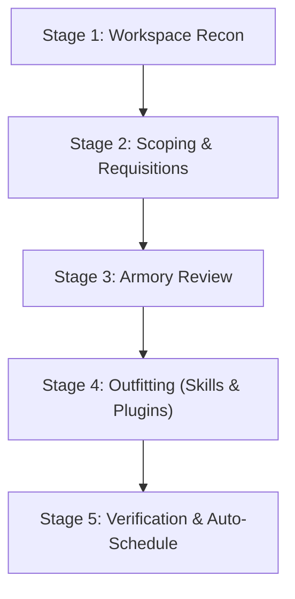

# Quartermaster: Project Onboarding & Skill Provisioning Armory

Quartermaster equips workspaces with project-scoped skills and full plugins tailored to their exact technology stack. Instead of overloading agents with global skills, Quartermaster provisions self-contained capabilities directly into `<workspace>/.agents/skills/` and `<workspace>/.agents/plugins/`, eliminating global token pollution and tool hallucination.

Quartermaster references an external central **skills library** (default: `~/.gemini/skills-library`), which can be configured via interactive settings. All skills and plugins live in the central library first, and Quartermaster dynamically plucks only the relevant capabilities into your project.

---

## Slash Commands Quick Reference

| Command | Action |
| :--- | :--- |
| **`/quartermaster`** | Run 5-stage workspace recon, scoping, capability provisioning, and auto-schedule |
| **`/quartermaster sweep`** | Audit active tools, recommend additions, and suggest or auto-prune unneeded tools |
| **`/quartermaster import <git-url>`** | Clones a git repo into your central armory and auto-equips it into your active project |
| **`/quartermaster core [add\|remove\|list]`** | Designate or remove Core capabilities via deterministic `.core` marker files |
| **`/quartermaster catalog`** | Browse all packages, plugins, and skills available in the central library |
| **`/quartermaster config`** | View or modify settings (`skills-library`, `pruning-mode`, `auto-prune`) |
| **`/quartermaster schedule`** | Automatically register or verify the daily background sweep for this workspace |

---

## Command 1: Initial Project Onboarding (`/quartermaster`)

When the user runs `/quartermaster`, execute the 5-stage onboarding workflow:



### Stage 1: Workspace Reconnaissance

1. **Identify Workspace Path**: Determine the active project root directory (defaults to current workspace).
2. **Execute Stack Scan**:
   ```bash
   python3 ~/.gemini/config/skills/quartermaster/scripts/quartermaster.py --scan <project_path> --json
   ```
3. **Examine Findings**:
   - Check `status`: Is this an active project with manifests, or an `unscoped_new_project`?
   - Review detected manifests (`pubspec.yaml`, `package.json`, `pyproject.toml`, `firebase.json`, `Cargo.toml`, `Dockerfile`, etc.).

---

### Stage 2: Scoping & Tailored Requisitions

#### Scenario A: Brand-New / Unscoped Project
If `status == "unscoped_new_project"` (no manifests found or empty directory):
1. **Interactive Scoping Dialogue**: Engage the user in a short scoping conversation:
   - *Option 1*: Web or Frontend Application
   - *Option 2*: Mobile or Multiplatform Application
   - *Option 3*: Backend API, Cloud or Database Service
   - *Option 4*: AI Agent or Machine Learning System
   - *Option 5*: DevOps, Infrastructure or Tooling
   - *Option 6*: **"I'm not sure yet"** (Exploring, prototyping, or undecided)

2. **The "I'm not sure yet" Rule**:
   > [!IMPORTANT]
   > Whenever the user chooses **"I'm not sure yet"** or the scope is broad/unclear, Quartermaster **strictly equips universal Core capabilities only** (specifications, code review, preflight checks, and orientation).
   > It explicitly avoids stack-specific tools (e.g. Flutter, Firebase, DevTools) until tech stack choices emerge. Explain this rationale to the user:
   > *"Since the project scope is still emerging, I will equip only foundational workflow guardrails (spec-driven engineering, adversarial review, preflight checks). As you create manifests and code, Quartermaster will suggest matching tech skills later via the daily sweep."*

#### Scenario B: Active Project with Identified Manifests
Present the detected technologies and categorize recommendations:
- **Core Capabilities Baseline**: Universal guardrails (`spec`, `pr-review`, `preflight`, `wayfinder`, `pm`).
- **Stack-Specific Capabilities**: Matched plugins (e.g. `modern-web-guidance-plugin`, `firebase`, `flutter`) and skills (e.g. `impeccable`, `uv`).

---

### Stage 3: Armory Review

Invite the user to inspect available packages and plugins discovered in the central skills library:
```bash
python3 ~/.gemini/config/skills/quartermaster/scripts/quartermaster.py --catalog
```
Allow the user to select any additional tools they wish to include.

---

### Stage 4: Outfitting (Dual Skill & Plugin Provisioning)

Once the user confirms their selection, execute the provisioning command:
```bash
python3 ~/.gemini/config/skills/quartermaster/scripts/quartermaster.py \
  --provision <project_path> \
  --skills <comma_separated_items>
```

Quartermaster automatically routes:
- **Full Plugins** (packages containing `plugin.json`, e.g. `modern-web-guidance-plugin`, `firebase`, `flutter`) &rarr; `<project_path>/.agents/plugins/<plugin_name>/`
- **Standalone Skills** (e.g. `impeccable`, `uv`) &rarr; `<project_path>/.agents/skills/<skill_name>/`

---

### Stage 5: Verification & Auto-Schedule

1. **Verify Installed Directory Structure**:
   - Check that `.agents/plugins/` contains full plugin bundles.
   - Check that `.agents/skills/` contains standalone skills.
2. **Present Confirmation Summary**:
   | Capability Name | Type | Destination |
   | :--- | :--- | :--- |
   | `modern-web-guidance-plugin` | Plugin | `.agents/plugins/modern-web-guidance-plugin/` |
   | `impeccable` | Skill | `.agents/skills/impeccable/` |
3. **Automatically Register Daily Sweep**:
   - Actively call the `schedule` tool:
     - `CronExpression`: `"0 9 * * *"`
     - `IsDaemon`: `true`
     - `Prompt`: `"Run /quartermaster sweep and notify only if additions or pruning recommendations are detected."`
   - Confirm to the user:
     *"Daily sweep scheduled: Quartermaster will run in the background daily at 9:00 AM to keep your workspace outfitted as your codebase evolves."*

---

## Command 2: Project Sweep (`/quartermaster sweep`)

When code evolves or dependencies are added/removed, the user triggers `/quartermaster sweep`.

### Execution:
```bash
python3 ~/.gemini/config/skills/quartermaster/scripts/quartermaster.py --sweep <project_path>
```
Flags supported:
- `/quartermaster sweep --aggressive`: Strict stack alignment (default). Flags any installed tools not matched by current tech manifests.
- `/quartermaster sweep --soft`: Conservative retention. Preserves cross-cutting or auxiliary tools unless explicit conflicts occur.
- `/quartermaster sweep --auto-prune`: Runs the sweep and automatically deletes unneeded tools from `.agents/`.
- `/quartermaster sweep --no-prune`: Suppresses removal suggestions (additions only).
- `/quartermaster sweep --no-auto-add`: Dry run; lists recommendations without automatically equipping them.

### Automated Actions During Sweep:
1. **Active Inventory Audit**: Reviews `.agents/plugins/` and `.agents/skills/`.
2. **Stack Detection**: Re-scans manifests (`package.json`, `pyproject.toml`, etc.).
3. **Auto-Equip New Additions**:
   - Because your central skills library is already a trusted, curated armory, Quartermaster **automatically provisions** newly matched tools straight into `.agents/`.
   - Never print bash commands like `python3 quartermaster.py --provision ...` to the user.
   - Simply confirm to the user what was automatically equipped and active in `.agents/`.
4. **Pruning Governance**:
   - Evaluates installed stack capabilities according to the configured `pruning-mode`:
     - **Aggressive (Default)**: Strict stack alignment. Flags any tool whose associated technology is not actively present in the workspace. Because the central library is local and instant, there is zero penalty to removing unused tools; they can be auto-equipped back in milliseconds if needed later.
     - **Soft**: Conservative retention. Preserves cross-cutting tools (e.g. web devtools or design craft) unless hard manifest contradictions exist.
   - If `auto-prune` is enabled (`true`), deletes them automatically from `.agents/`.
   - If `suggest-pruning` is enabled (`true`, default), lists them as removal recommendations so the developer can decide.
   - Core capabilities (marked with a `.core` file, such as `spec`, `pr-review`, `preflight`, `wayfinder`, `pm`) are permanent guardrails and are never marked for pruning.

---

## Command 3: In-Flow Git Import (`/quartermaster import <git-url>`)

When the user pastes a repository URL in chat:
```text
/quartermaster import https://github.com/example/cool-skill
```

Execute the import engine:
```bash
python3 ~/.gemini/config/skills/quartermaster/scripts/quartermaster.py --import <git_url> --project <project_path>
```

Quartermaster performs dual action:
1. **Central Armory**: Clones the repository into `~/.gemini/skills-library/<repo-name>`, discovering and indexing its skills or plugins.
2. **Active Project Outfitting**: If run from within an active project workspace, Quartermaster **immediately provisions** the imported capability into that project's `.agents/` folder (`.agents/plugins/<name>/` for full plugins or `.agents/skills/<name>/` for standalone skills).
3. If executed outside an active project, it imports into the central library only. Use `--no-project` to explicitly skip project outfitting.

---

## Command 4: Core Capability Governance (`/quartermaster core [add|remove|list]`)

Quartermaster uses a deterministic `.core` marker file inside skill and plugin folders to identify permanent guardrails. Core capabilities are always auto-equipped on onboarding and are strictly immune to sweep pruning.

Conventional workflow capabilities (`spec`, `pr-review`, `pm`, `preflight`, `wayfinder`, `review`) are automatically bootstrapped with `.core` files during scans, catalog checks, or sweeps.

Users can also explicitly designate custom packages or tools as Core:

### 1. List Core Capabilities:
```bash
python3 ~/.gemini/config/skills/quartermaster/scripts/quartermaster.py --core-list
```
Or within a specific workspace:
```bash
python3 ~/.gemini/config/skills/quartermaster/scripts/quartermaster.py --core-list --project <project_path>
```

### 2. Designate a Capability as Core:
```bash
python3 ~/.gemini/config/skills/quartermaster/scripts/quartermaster.py --core-add <name> --project <project_path>
```
Attaches a `.core` marker file in the matching skill/plugin directory within the workspace and the central library armory. Once marked, this tool will never be pruned during sweeps and will be equipped on initial setup.

### 3. Remove Core Designation:
```bash
python3 ~/.gemini/config/skills/quartermaster/scripts/quartermaster.py --core-rm <name> --project <project_path>
```
Deletes the `.core` marker file, returning the capability to standard stack-aligned pruning governance.

---

## Command 5: Browse Catalog (`/quartermaster catalog`)

When the user runs `/quartermaster catalog`, execute:
```bash
python3 ~/.gemini/config/skills/quartermaster/scripts/quartermaster.py --catalog
```
Present the discovered packages, plugins, and skills from the central library, clearly distinguishing between Core guardrails and stack-specific tools.

---

## Command 6: Settings & Config (`/quartermaster config`)

When the user asks to view or change settings:
```bash
# View active settings
python3 ~/.gemini/config/skills/quartermaster/scripts/quartermaster.py --config --json

# Update a setting
python3 ~/.gemini/config/skills/quartermaster/scripts/quartermaster.py --config-set <key> <value>
```

Present active settings in a clean Markdown table. When the user requests a setting change, execute `--config-set` behind the scenes and confirm the update. Never ask the user to run bash commands.

Settings keys:
- `skills-library`: Absolute path to central library folder.
- `auto-add`: Boolean (`true` / `false`), controls whether newly matching tools are automatically provisioned into `.agents/` during sweeps (default: `true`).
- `suggest-pruning`: Boolean (`true` / `false`), controls whether unneeded skills are suggested for removal during sweeps (default: `true`).
- `auto-prune`: Boolean (`true` / `false`), controls whether unneeded skills are deleted automatically during sweeps (default: `false`).
- `pruning-mode`: String (`aggressive` / `soft`), controls pruning strategy: strict stack alignment vs conservative retention (default: `aggressive`).

---

## Command 7: Schedule Daily Sweep (`/quartermaster schedule`)

When the user runs `/quartermaster schedule`:
1. Actively call the `schedule` tool:
   - `CronExpression`: `"0 9 * * *"`
   - `IsDaemon`: `true`
   - `Prompt`: `"Run /quartermaster sweep and notify only if additions or pruning recommendations are detected."`
2. Confirm to the user:
   *"Automated daily sweep is active! Quartermaster will audit this project every morning at 9:00 AM and notify you only if additions or cleanup recommendations are detected."*
