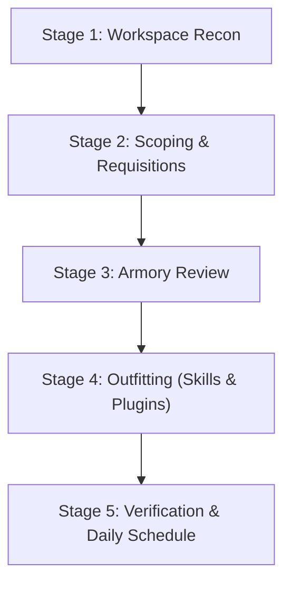

# Quartermaster: Project Onboarding & Skill Provisioning Armory

Quartermaster equips workspaces with project-scoped skills and full plugins tailored to their exact technology stack. Instead of overloading agents with global skills, Quartermaster provisions self-contained capabilities directly into `<workspace>/.agents/skills/` and `<workspace>/.agents/plugins/`, eliminating global token pollution and tool hallucination.

Quartermaster references an external **skills library** (default: `~/.gemini/skills-library`), which can be configured via interactive settings.

---

## Core Operational Modes

Quartermaster operates across three distinct modes:
1. **Initial Project Onboarding (`/quartermaster`)**: 5-stage setup for active or brand-new projects.
2. **Interactive Sweep (`/quartermaster sweep`)**: Workspace audit comparing installed capabilities against evolving tech manifests and the armory.
3. **Scheduled Daily Sweep**: Background cron job running daily with `--additions-only` mode for frictionless skill onboarding.

---

## Mode 1: The 5-Stage Initial Onboarding Workflow



### Stage 1: Workspace Reconnaissance

1. **Identify Workspace Path**: Determine the active project root directory (defaults to current workspace).
2. **Execute Stack Scan**:
   ```bash
   python3 /Users/owaino/quartermaster/scripts/quartermaster.py --scan <project_path> --json
   ```
3. **Examine Findings**:
   - Check `status`: Is this an active project with manifests, or an `unscoped_new_project`?
   - Review detected manifests (`pubspec.yaml`, `package.json`, `pyproject.toml`, `firebase.json`, `Cargo.toml`, `Dockerfile`, etc.).

---

### Stage 2: Scoping & Tailored Requisitions

#### Scenario A: Brand-New / Unscoped Project
If `status == "unscoped_new_project"` (no manifests found or empty directory):
1. **Interactive Scoping Dialogue**: Engage the user in a short scoping conversation:
   - *Option 1*: Web or Frontend Application
   - *Option 2*: Mobile or Multiplatform Application
   - *Option 3*: Backend API, Cloud or Database Service
   - *Option 4*: AI Agent or Machine Learning System
   - *Option 5*: DevOps, Infrastructure or Tooling
   - *Option 6*: **"I'm not sure yet"** (Exploring, prototyping, or undecided)

2. **The "I'm not sure yet" Rule**:
   > [!IMPORTANT]
   > Whenever the user chooses **"I'm not sure yet"** or the scope is broad/unclear, Quartermaster **strictly equips universal Core AI-SDLC skills only** (`spec`, `pr-review`, `preflight`, `wayfinder`).
   > It explicitly avoids stack-specific tools (e.g. Flutter, Firebase, DevTools) until tech stack choices emerge. Explain this rationale to the user:
   > *"Since the project scope is still emerging, I will equip only foundational AI-SDLC guardrails (spec-driven engineering, adversarial review, preflight checks). As you create manifests and code, Quartermaster will suggest matching tech skills later via the daily sweep."*

#### Scenario B: Active Project with Identified Manifests
Present the detected technologies and categorize recommendations:
- **Core AI-SDLC Baseline**: Universal guardrails (`spec`, `pr-review`, `preflight`, `wayfinder`).
- **Stack-Specific Capabilities**: Matched plugins (e.g. `modern-web-guidance-plugin`, `firebase`, `flutter`) and skills (e.g. `impeccable`, `uv`).

---

### Stage 3: Armory Review

Invite the user to inspect available packages and plugins discovered in the central skills library:
```bash
python3 /Users/owaino/quartermaster/scripts/quartermaster.py --catalog
```
Allow the user to select any additional tools they wish to include.

---

### Stage 4: Outfitting (Dual Skill & Plugin Provisioning)

Once the user confirms their selection, execute the provisioning command:
```bash
python3 /Users/owaino/quartermaster/scripts/quartermaster.py \
  --provision <project_path> \
  --skills <comma_separated_items>
```

Quartermaster automatically routes:
- **Full Plugins** (packages containing `plugin.json`, e.g. `spark-skills`, `firebase`, `flutter`) &rarr; `<project_path>/.agents/plugins/<plugin_name>/`
- **Standalone Skills** (e.g. `impeccable`, `uv`) &rarr; `<project_path>/.agents/skills/<skill_name>/`

---

### Stage 5: Verification & Daily Schedule

1. **Verify Installed Directory Structure**:
   - Check that `.agents/plugins/` contains full plugin bundles.
   - Check that `.agents/skills/` contains standalone skills.
2. **Present Confirmation Summary**:
   | Capability Name | Type | Destination |
   |-----------------|------|-------------|
   | `spark-skills`  | Plugin | `.agents/plugins/spark-skills/` |
   | `impeccable`    | Skill  | `.agents/skills/impeccable/` |
3. **Offer Scheduled Daily Sweep**:
   - Offer to set up a recurring daily background sweep so new skills are quietly recommended as the project grows.

---

## Mode 2: Interactive Quartermaster Sweep (`/quartermaster sweep`)

When a project evolves (e.g. new dependencies added or removed), run a sweep:

```bash
python3 /Users/owaino/quartermaster/scripts/quartermaster.py --sweep <project_path>
```

### What the Sweep Audits:
1. **Active Project Inventory**: Lists all plugins in `.agents/plugins/` and skills in `.agents/skills/`.
2. **Stack Changes**: Re-scans manifests and dependencies.
3. **Recommended Additions**: Identifies newly relevant skills or plugins from the library not yet provisioned.
4. **Pruning Candidates**: In interactive mode, highlights installed stack-specific skills whose manifests were removed. Core AI-SDLC skills are never marked for pruning.

---

## Mode 3: Scheduled Daily Background Sweep (Zero Friction)

To keep workspaces outfitted with zero interruption:
- Quartermaster runs the sweep with `--additions-only`:
  ```bash
  python3 /Users/owaino/quartermaster/scripts/quartermaster.py --sweep <project_path> --additions-only --json
  ```
- **Frictionless Policy**:
  - **Strictly Additions Only**: Automated background sweeps *never* recommend pruning or removing skills.
  - **Quiet Execution**: If no new skills are found, exits with zero output or notifications.
  - **Discreet Alert**: If new matching skills are detected, delivers a gentle, non-blocking notification:
    > *"Quartermaster Sweep: 2 new capabilities match your updated stack (`firebase`, `chrome-devtools-plugin`). Run `/quartermaster sweep` to review or outfit."*

### Registering the Daily Scheduled Task in AGY
Use the Antigravity `schedule` tool or `/schedule` to set up a recurring daily cron job:
- **CronExpression**: `"0 9 * * *"` (daily at 9:00 AM)
- **IsDaemon**: `true`
- **Prompt**: `"Run Quartermaster background sweep for <project_path> using python3 ~/quartermaster/scripts/quartermaster.py --sweep <project_path> --additions-only --json and notify only if new skills are recommended."`

---

## Configuring Settings & Skills Library Location

Quartermaster settings are persisted globally in `~/.gemini/quartermaster/config.json`.

```bash
# View current settings
python3 /Users/owaino/quartermaster/scripts/quartermaster.py --config

# Get skills-library location
python3 /Users/owaino/quartermaster/scripts/quartermaster.py --config-get skills-library

# Update skills-library location
python3 /Users/owaino/quartermaster/scripts/quartermaster.py --config-set skills-library /path/to/custom-library
```
